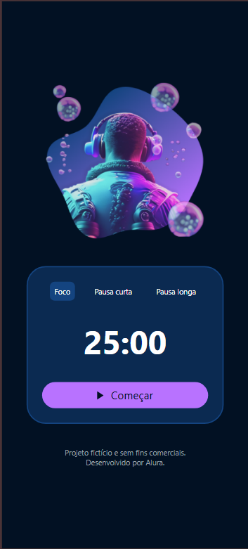

# Aplicativo Fokus

Primeiro aplicativo desenvolvido durante a formação [React Native: Desenvolva seu primeiro app](https://cursos.alura.com.br/formacao-react-native-primeiro-app) da **Alura**.

## Aprendizados:

Iniciamos o projeto do zero, onde foi trabalhado:

- A implementar funções de toggle para iniciar e pausar um timer usando useRef do React.
- A utilizar setInterval e clearInterval para gerenciar a execução periódica de código.
- A manipular e atualizar dinamicamente o texto de botões com base no estado do aplicativo.
  As diferenças de comportamento entre useState e useRef no React.
- A importância de usar uma biblioteca como React Native SVG para manipular SVGs no React Native.
- A instalar bibliotecas no Expo usando npx expo install.
- A ajustar dinamicamente ícones com base no estado do timer, melhorando a interatividade.

## 🚀 Tecnologias

<h2> 📞 Contato</h2>

 
  
  
   
  

